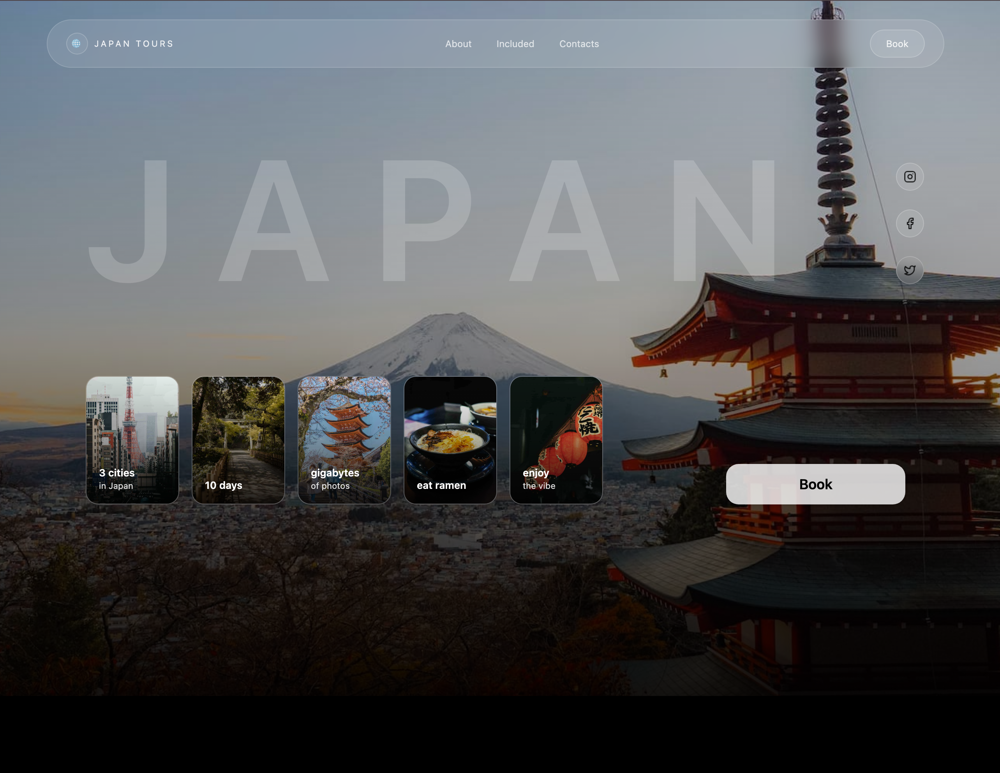

# Japan Tours — Premium Travel Landing Page

A modern, responsive, single-page landing website for a travel/tour service, designed with a strong focus on visual quality, smooth motion, and real-world usability.

This project demonstrates how a production-ready marketing page can be built using React and Tailwind CSS, enhanced with Framer Motion animations and a real contact form integration.

Live Demo:https://japan-travel-eight.vercel.app/
Repository: https://github.com/SubDan12/japan-travel

## Screenshots

## Project Overview

**Japan Tours** is a premium travel landing page showcasing a 10-day guided tour across Japan.  
The page is designed to feel modern, elegant, and trustworthy while remaining lightweight and fast.

The goal of this project was to:

- build a visually polished landing page
- ensure full responsiveness across mobile, tablet, and desktop
- integrate real functionality (contact form)
- follow clean component architecture
- deploy a real, usable website

---

## Key Features

- Fully responsive design (mobile / tablet / desktop)
- Premium glassmorphism UI with layered gradients
- Smooth animations using Framer Motion
- Horizontal card scrolling optimized for touch devices
- Real contact form integration via Formspree
- Clean, scalable React component structure
- Optimized for deployment and real usage

---

## Tech Stack

- **React** (with Vite)
- **Tailwind CSS**
- **Framer Motion**
- **Formspree** (contact form handling)
- **Vercel** (deployment)

---

## Folder Structure

JAPAN-TRAVEL/
│
├── public/
│ ├── images/ # All page images
│ ├── social/ # Social media icons
│ └── icon.png
│
├── src/
│ ├── components/
│ │ ├── about/ # About section UI primitives
│ │ │ ├── Dot.jsx
│ │ │ ├── Label.jsx
│ │ │ ├── MobileStop.jsx
│ │ │ ├── Photo.jsx
│ │ │ ├── SectionTitle.jsx
│ │ │ └── StackedImages.jsx
│ │ │
│ │ ├── hero/ # Hero section UI components
│ │ │ ├── FeatureCard.jsx
│ │ │ └── SocialIcon.jsx
│ │ │
│ │ ├── Navbar.jsx
│ │ ├── Hero.jsx
│ │ ├── About.jsx
│ │ ├── Included.jsx
│ │ └── Contacts.jsx
│ │
│ ├── sections/
│ │ └── Home.jsx # Page composition
│ │
│ ├── utils/
│ │ └── motion.js # Shared Framer Motion variants
│ │
│ ├── App.jsx
│ ├── main.jsx
│ └── index.css
│
├── index.html
├── package.json
├── package-lock.json
├── vite.config.js
├── eslint.config.js
├── .gitignore
└── README.md
